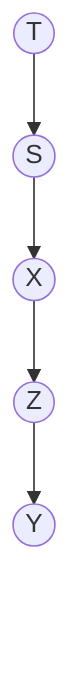
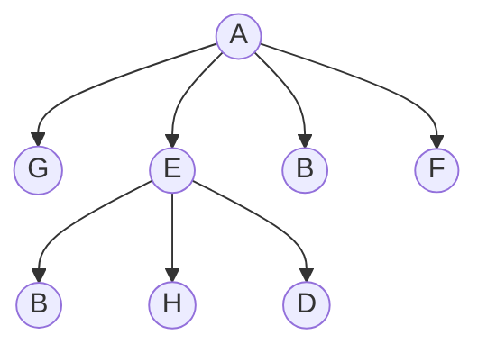
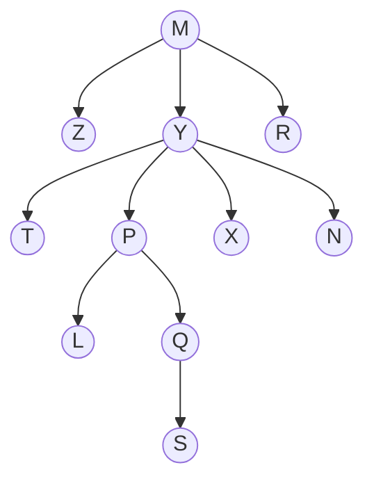
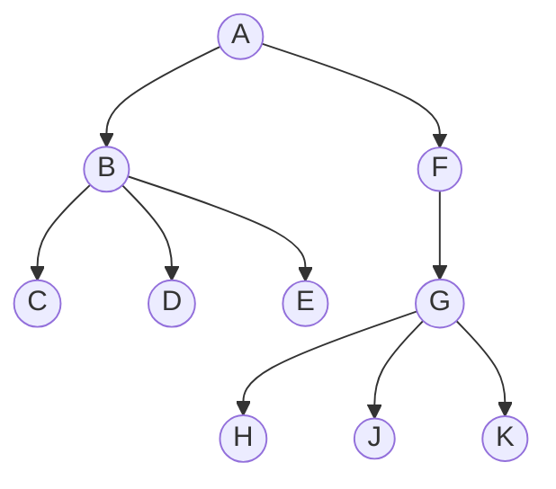

# Workshop 6 - Trees and Algorithms

## Part A: Tree Algorithms

### Question 1: Structure and Traversal

For each of the following trees:

1. Draw a diagram showing how the structure of the tree is stored;
2. Use Breadth-First and Depth-First Traversals to traverse it.

{: .note-title}
> **Note:**
>
> A node is has a key and two references to its `Child` and `Sibling` nodes. The `^` symbol is used to represent a null reference.
>
> ```mermaid
> block-beta
> columns 1
> block:T
> T_k["Value"] T_c["Child"] T_s["Sibling"]
> end
> ```
>
> **Breadth-First Traversal** visits all the nodes on a level before moving to the next level.
>
> **Depth-First Traversal** visits the root, then its subtree from left to right, prioritising visiting children before siblings.

(a)



{: .note-title }
> **Answer:**
>
> The structure of the tree is stored as follows:
>
> ```mermaid
> block-beta
> columns 1
> block:T
> T_k["T"] T_c[" "] T_s["^"]
> end
> block:S
> S_k["S"] S_c[" "] S_s["^"]
> end
> block:X
> X_k["X"] X_c[" "] X_s["^"]
> end
> block:Z
> Z_k["Z"] Z_c[" "] Z_s["^"]
> end
> block:Y
> Y_k["Y"] Y_c[" "] Y_s["^"]
> end
> T_c --> S_k
> S_c --> X_k
> X_c --> Z_k
> Z_c --> Y_k
> ```
> **Breadth-First Traversal:** T, S, X, Z, Y
> 
> **Depth-First Traversal:** T, S, X, Z, Y

(b)



{: .note-title }
> **Answer:**
>
> The structure of the tree is stored as follows:
>
> ```mermaid
> block-beta
>   columns 4
>   space:1
>   block:first
>     block:A
>     A_k["A"] A_c[" "] A_s["^"]
>     end
>   end
>   space:2
>   block:second:4
>     block:G
>     G_k["G"] G_c["^"] G_s[" "]
>     end
>     block:E
>     E_k["E"] E_c[" "] E_s[" "]
>     end
>     block:B
>     B_k["B"] B_c["^"] B_s[" "]
>     end
>     block:F
>     F_k["F"] F_c["^"] F_s["^"]
>     end
>   end
>   space:1
>   block:third:3
>     block:B1
>       B1_k["B"] B1_c["^"] B1_s[" "]
>     end
>     block:H
>       H_k["H"] H_c[" "] H_s[" "]
>     end
>     block:D
>       D_k["D"] D_c["^"] D_s["^"]
>     end
>   end
>   A_c --> G_k
>   G_s --> E_k
>   E_s --> B_k
>   B_s --> F_k
>   E_c --> B1_k
>   B1_s --> H_k
>   H_s --> D_k
> ```
> **Breadth-First Traversal:** A, G, E, B, F, B1, H, D
>
> **Depth-First Traversal:** A, G, E, B1, H, D, B, F

(c)



{: .note-title }
> **Answer:**
>
> The structure of the tree is stored as follows:
>
> ```mermaid
> block-beta
>   columns 4
>   space:1
>   block:first
>     block:M
>     M_k["M"] M_c[" "] M_s["^"]
>     end
>   end
>   space:2
>   block:second:3
>     block:Z
>     Z_k["Z"] Z_c["^"] Z_s[" "]
>     end
>     block:Y
>     Y_k["Y"] Y_c[" "] Y_s[" "]
>     end
>     block:R
>     R_k["R"] R_c["^"] R_s["^"]
>     end
>   end
>   space:1
>   block:third:4
>     block:T
>     T_k["T"] T_c["^"] T_s[" "]
>     end
>     block:P
>     P_k["P"] P_c[" "] P_s[" "]
>     end
>     block:X
>     X_k["X"] X_c["^"] X_s[" "]
>     end
>     block:N
>     N_k["N"] N_c["^"] N_s["^"]
>     end
>   end
>   space:1
>   block:fourth:2
>     block:L
>     L_k["L"] L_c["^"] L_s[" "]
>     end
>     block:Q
>     Q_k["Q"] Q_c["^"] Q_s[" "]
>     end
>   end
>   space:3
>   block:fifth:1
>     block:S
>     S_k["S"] S_c["^"] S_s["^"]
>     end
>   end
>   M_c --> Z_k
>   Z_s --> Y_k
>   Y_s --> R_k
>   Y_c --> T_k
>   T_s --> P_k
>   P_s --> X_k
>   X_s --> N_k
>   P_c --> L_k
>   L_s --> Q_k
>   Q_s --> S_k
> ```
> **Breadth-First Traversal:** M, Z, Y, R, T, P, X, N, L, Q, S
>
> **Depth-First Traversal:** M, Z, Y, T, P, L, Q, S, X, N, R

### Question 2: Breath-First Traversal

Given the following tree:



Show the state of the queue, `q`, after each node in the above tree is visited while using the `Breadth-First Traversal` algorithm.


{: .note-title }
> **Answer:**
>
> | Step | Node to visit | `q` | Note |
> |------|-----|-----| ---- |
> | `q = new Queue`    | -  |  []  | Start with an empty queue |
> | `q.enqueue(A)`     | -  | [A]  | Add root node to be visited later |
> | `q.dequeue()`       | A          | []   | Entered the loop, visit A |
> | `r = r.Child` (B)  | -          | []   | |
> | `q.enqueue(B)`     | -  | [B]  | Add B to the queue |
> | `r = r.Sibling` (F) | -          | [B]  | |
> | `q.enqueue(F)`     | -  | [B, F]  | Add F to the queue. `F.Sibling` is now null, stop adding |
> | `q.dequeue()`       | B          | [F]  | Visit B |
> | `r = r.Child` (C)  | -          | [F]  | |
> | `q.enqueue(C)`     | -  | [F, C]  | Add C to the queue |
> | `r = r.Sibling` (D) | -          | [F, C]  | |
> | `q.enqueue(D)`     | -  | [F, C, D]  | Add D to the queue |
> | `r = r.Sibling` (E) | -          | [F, C, D]  | |
> | `q.enqueue(E)`     | -  | [F, C, D, E]  | Add E to the queue. `E.Sibling` is now null, stop adding |
> | `q.dequeue()`       | F          | [C, D, E]  | Visit F |
> | `r = r.Child` (G)  | -          | [C, D, E]  | |
> | `q.enqueue(G)`     | -  | [C, D, E, G]  | Add G to the queue |
> | `r = r.Sibling` (null) | -          | [C, D, E, G]  | |
> | `q.dequeue()`       | C          | [D, E, G]  | Visit C |
> | `r = r.Child` (null)  | -          | [D, E, G]  | |
> | `q.dequeue()`       | D          | [E, G]  | Visit D |
> | `r = r.Sibling` (null)  | -          | [E, G]  | |
> | `q.dequeue()`       | E          | [G]  | Visit E |
> | `r = r.Sibling` (null)  | -          | [G]  | |
> | `q.dequeue()`       | G          | []  | Visit G |
> | `r = r.Child` (H)  | -          | []  | |
> | `q.enqueue(H)`     | -  | [H]  | Add H to the queue |
> | `r = r.Sibling` (J) | -          | [H]  | |
> | `q.enqueue(J)`     | -  | [H, J]  | Add J to the queue |
> | `r = r.Sibling` (K) | -          | [H, J]  | |
> | `q.enqueue(K)`     | -  | [H, J, K]  | Add K to the queue. `K.Sibling` is now null, stop adding |
> | `q.dequeue()`       | H          | [J, K]  | Visit H |
> | `r = r.Sibling` (J)  | -          | [J, K]  | |
> | `q.dequeue()`       | J          | [K]  | Visit J |
> | `r = r.Sibling` (K)  | -          | [K]  | |
> | `q.dequeue()`       | K          | []  | Visit K |
> | `r = r.Sibling` (null)  | -          | []  | End of traversal |

### Question 3: Depth-First Traversal

Given the following tree:


Show the state of the stack, `s`, after each node in the above tree is visited while using the `Depth-First Traversal` algorithm.

{: .note-title }
> **Answer:**
>
> Note that the top of the stack is the right most element in the list. For example, [A, B, C] would mean that C is at the top of the stack and is the first to be visited.
> 
> | Step | Node to visit | `s` | Note |
> |------|-----|-----| ---- |
> | `s = new Stack`    | -  |  []  | Start with an empty stack |
> | `s.push(A)`     | -  | [A]  | Add root node to be visited later |
> | `r = s.pop()` (A)       | - | []   | Entered the loop |
> | `visit A`       | A | []   | Entered inner loop, visit A |
> | `A.Sibling` (null), so no push | - | [] | No siblings, stop adding to stack |
> | `r = A.Child` (B)  | -          | []   | |
> | `visit B`       | B          | []  | Visit B |
> | `B.Sibling` (F), so `push F` | - | [F] | Add F to the stack |
> | `r = B.Child` (C)  | -          | [F]   | |
> | `visit C`       | C          | [F]  | Visit C |
> | `C.Sibling` (D), so `push D` | - | [F, D] | Add D to the stack |
> | `r = C.Child` (null)  | -          | [F, D]   | No more child, get from stack |
> | `r = s.pop()` (D)       | - | [F]   | |
> | `visit D`       | D          | [F]  | Visit D |
> | `D.Sibling` (E), so `push E` | - | [F, E] | Add E to the stack |
> | `r = D.Child` (null)  | -          | [F, E]   | No more child, get from stack |
> | `r = s.pop()` (E)       | - | [F]   | |
> | `visit E`       | E          | [F]  | Visit E |
> | `E.Sibling` (null), so no push | - | [F] | No siblings, stop adding to stack |
> | `r = E.Child` (null)  | -          | [F]   | No more child, get from stack |
> | `r = s.pop()` (F)       | - | []   | |
> | `visit F`       | F          | []  | Visit F |
> | `F.Sibling` (null), so no push | - | [] | No siblings, stop adding to stack |
> | `r = F.Child` (G)  | -          | []   | |
> | `visit G`       | G          | []  | Visit G |
> | `G.Sibling` (null), so no push | - | [] | No siblings, stop adding to stack |
> | `r = G.Child` (H)  | -          | []   | |
> | `visit H`       | H          | []  | Visit H |
> | `H.Sibling` (J), so `push J` | - | [J] | Add J to the stack |
> | `r = H.Child` (null)  | -          | [J]   | No more child, get from stack |
> | `r = s.pop()` (J)       | - | []   | |
> | `visit J`       | J          | []  | Visit J |
> | `J.Sibling` (K), so `push K` | - | [K] | Add K to the stack |
> | `r = J.Child` (null)  | -          | [K]   | No more child, get from stack |
> | `r = s.pop()` (K)       | - | []   | |
> | `visit K`       | K          | []  | Visit K |
> | `K.Sibling` (null), so no push | - | [] | No siblings, stop adding to stack |
> | `r = K.Child` (null)  | -          | []   | No more child, get from stack |
> | `r = s.pop()` (null)       | - | []   | End of traversal |

## Part B: Programming Tasks

### Question 4: Counting Nodes

Extend the attached Tree ADT to include a method `Count` to count the number of nodes in the tree. Please add a method specification to the Tree ADT specification and provide an implementation for the method. (**Hints**: Use a counter. Initially, the counter is set to zero. Then, traverse the tree. When a node is visited, the counter is incremented by one.)

{: .note-title }
> **Answer:**
>
> Use any traversal method, and replace each visit with an increment of the counter. The counter should be initialised to 0 before the traversal starts.
>
> ```csharp
> public int Count()
> {
>     int counter = 0;
>     IQueue q = new Queue();
>     q.Enqueue(root);
>     while (!q.IsEmpty())
>     {
>         TreeNode ptr = (TreeNode)q.Dequeue();
>         counter++; //increment the counter by one 
>                     // when visiting a node
>         TreeNode child = ptr.Child;
>         while (child != null)
>         {
>             q.Enqueue(child);
>             child = child.Sibling;
>         }
>     }
>     return counter;
> }
> ```