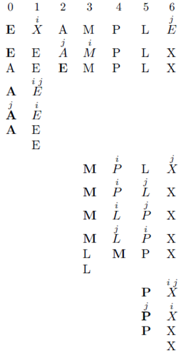
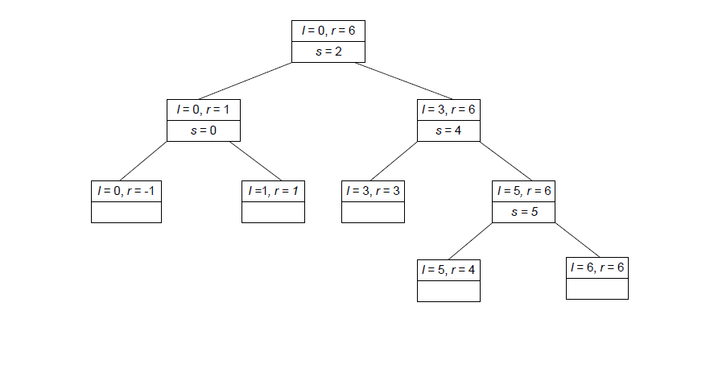
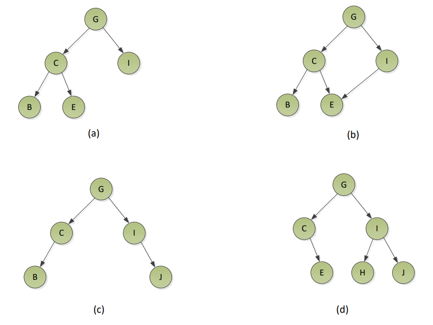
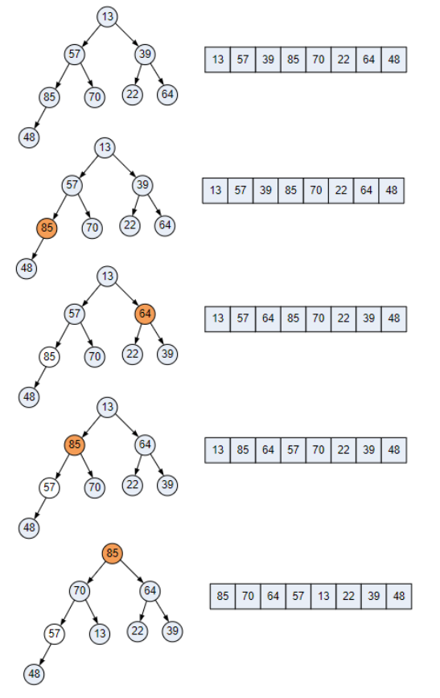
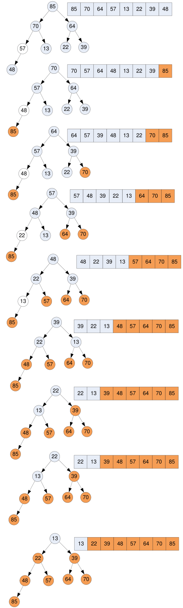

# Workshop 7 - Advanced Sorting Algorithms

## Question 1: Merge Sort

a. Using the merge sort algorithm in Lecture 7 to sort an array of integers below:
[38, 27, 43, 3, 9, 82, 10]

{: .note-title }
> **Answer**
>
> The following diagram shows the process of sorting the array using the merge sort algorithm.
>
> 
>
> Array: [38 27 43 3 9 82 10]
> 
> Split to: [38 27 43 3] [ 9 82 10]
> 
> Whole array at current state: [38 27 43 3] [ 9 82 10]
> 
> Sub-array: [38 27 43 3] (left sub array)
> 
> Split to: [38 27][43 3]
> 
> Whole array at current state: [38 27][43 3] [ 9 82 10]
> 
> Sub-array: [38 27]
> 
> Split to: [38][27]
> 
> Whole array at current state: [38][27][43 3] [ 9 82 10]
> 
> Merge [38][27] to [27 38]
> 
> Whole array at current state: [27 38][43 3] [ 9 82 10]
> 
> Sub-array: [43 3]
> 
> Split to: [43][3]
> 
> Whole array at current state: [27 38][43][3] [ 9 82 10]
> 
> Merge [43][3] to [3 43]
> 
> Whole array at current state: [27 38][3 43] [ 9 82 10]
> 
> Merge [27 38][3 43] to [3 27 38 43]
> 
> Whole array at current state: [3 27 38 43] [ 9 82 10]
> 
> Left major sub-array merged, continue to sort right major sub-array [9 82 10]
> 
> Sub-array: [9 82 10]
> 
> Split to: [9 82][10]
> 
> Whole array at current state: [3 27 38 43] [ 9 82][10]
> 
> Sub-array: [9 82]
> 
> Split to: [9][82]
> 
> Whole array at current state: [3 27 38 43] [ 9][82][10]
> 
> Merge [9][92] to [9 82]
> 
> Whole array at current state: [3 27 38 43] [ 9 82][10]
> 
> Merge [9 82][10] to [9 10 82]
> 
> Whole array at current state: [3 27 38 43] [9 10 82]
> 
> Both major sub-arrays has been formed: [3 27 38 43] [9 82 10]
> 
> Merge [3 27 38 43] [9 82 10] to the sorted array [3 9 10 27 38 43 82]

b. What is the major advantage of the merge sort algorithm over the quick sort and
heap sort algorithms? Explain this property.

{: .note-title }
> **Answer**
>
> Stability: A sorting algorithm is stable if two elements with equal keys appear in the same order in sorted output as in the input unsorted array.

c. What is the main disadvantage of the merge sort algorithm compared to the quick
sort and heap sort algorithms (Assume the common implementation of merge sort
as discussed in Lecture 7)?

{: .note-title }
> **Answer**
>
> The principal shortcoming of merge sort is the linear amount of extra storage the algorithm requires. Though merging can be done in place, the resulting algorithm is complicated.

## Question 2: Quick Sort

a. Thinking about the number of key comparisons made before a partition is achieved in what case will the splits be most extremely skewed (i.e. one of the
subarrays will be empty and the other will be 1 less than the size of the subarray
being partitioned)? Assume the Hoare Partition method is used to determine the
pivot.

{: .note-title }
> **Answer**
>
> In the worst case, all the splits will be skewed to the extreme: one of the two subarrays will be empty, and the size of the other will be just 1 less than the size of the subarray being partitioned. This unfortunate situation will happen, in particular, for sorted arrays, i.e., for inputs for which the problem is already solved.


b. Apply the quick sort algorithm to sort the list:

[E, X, A, M, P, L, E]

Draw a tree showing the recursive calls made in Part b.

{: .note-title }
> **Answer**
>
> Note that the bolded letter is the pivot element. In each step:
>
> 1. The first element of the unsorted part is selected as pivot.
> 2. The cursor *i* moves from left to right, until it finds an element greater than the pivot.
> 3. The cursor *j* moves from right to left, until it finds an element smaller than the pivot.
> 4. The elements at *i* and *j* are swapped.
> 5. Repeat steps 2-4 until *i* and *j* cross each other (*j* < *i*).
>
> 
>
> The following shows the recursive calls, with the top box showing the $l$ and $r$ values passed to the **partition** algorithm, and the bottom showing the split position $s$ (empty if none).
>
> 

## Question 3: Heap Sort

a. Which of the following are true for a complete binary tree of height _h_

i. All nodes at level h-2 and above have one child only

ii. When a node at level h- 1 has children all nodes to the left at the same level
have two children each

iii. When a node at level h- 1 has only one child it is a right child

iv. If a node is stored at index i the left child of the node is stored at index
2×i+1 (assume root node is at index 0)

{: .note-title }
> **Answer**
>
> i. False, they should have two children each.
> 
> ii. True.
> 
> iii. False. The left child is filled first.
> 
> iv. True.

b. Which of the following are complete binary trees?



{: .note-title }
> **Answer**
>
> a. Complete binary tree.
> 
> b. Not a complete binary tree, as E has two parents.
> 
> c. Not a complete binary tree as C is missing a right child, and I is missing a left child.
> 
> d. Not a complete binary tree as C is missing a left child.

c. You are given the following array (which is NOT a heap).

[13, 57, 39, 85, 70, 22, 64, 48]

Draw the initial complete binary tree to which it corresponds. Show how the
complete binary tree is converted into a heap. Trace the action of the Heap Sort
algorithm on the heap. (Show the resulting heap after each data item is removed
from the root and added to the end of the array.)

{: .note-title }
> **Answer**
>
> The following diagram shows the process of converting the complete binary tree into a heap. In general:
>
> 1. Start from the bottom right node that has at least one child.
> 2. If the parent is smaller than any of its children, swap the parent with the larger child.
> 3. Repeat the process, moving right to left, bottom to top (hence, bottom-up).
>
> 
>
> The following diagram shows the process of sorting the array using the heap sort algorithm. In general:
>
> 1. Convert the array into a heap.
> 2. Remove the root element and replace it with the last (right-most) element in the heap.
> 3. Decrease the size of the heap by 1.
> 4. Heapify the complete binary tree.
> 5. Repeat steps 2-4 until the heap is empty.
>
> 

## Question 4: Heap Sort Implementation

Implement the heap sort algorithm in C#.

{: .note-title }
> **Answer**
>
> See the code below, ideally in the following order:
>
> 1. `HeapBottomUp`: Convert a complete binary tree into a heap.
> 2. `MaxKeyDelete`: Delete the maximum key and rebuild the heap. While it takes the whole array, it only works on the first `size` elements (i.e., the heap).
> 3. `HeapSort`: Sort the elements in an array by building a heap, and repeatedly removing the maximum key.

```csharp
namespace HeapSort
{
    class Program
    {
        const int ARRAY_SIZE = 10;
        const int RANDOM_MAX = 1000;

        static void Main(string[] args)
        {
            int seed = (int)DateTime.Now.Ticks;
            Random number = new Random(seed);
            Random rnd = new Random(seed);
            int[] nums = new int[ARRAY_SIZE];
            for (int i = 0; i < ARRAY_SIZE; i++)
                // randomly generate an integer beteen 0 and RAMDOM_MAX
                nums[i] = rnd.Next(RANDOM_MAX);

            Console.Clear();
            Console.WriteLine();
            Console.WriteLine("before heap sorting:");
            for (int i = 0; i < ARRAY_SIZE; i++)
            {
                Console.WriteLine(nums[i]);
            }

            HeapSort(nums);

            Console.WriteLine();
            Console.WriteLine("after heap sorting:");
            for (int i = 0; i < ARRAY_SIZE; i++)
            {
                Console.WriteLine(nums[i]);
            }

            Console.ReadLine();
        }

        // convert a complete binary tree into a heap
        static void HeapBottomUp(int[] data)
        {
            int n = data.Length;
            for (int i = (n - 1) / 2; i >= 0; i--)
            {
                int k = i;
                int v = data[i];
                bool heap = false;
                while ((!heap) && ((2 * k + 1) <= (n - 1)))
                {
                    int j = 2 * k + 1;  //the left child of k
                    if (j < (n - 1))   //k has two children
                        if (data[j] < data[j + 1])
                            j = j + 1;  //j is the larger child of k
                    if (v >= data[j])
                        heap = true;
                    else
                    {
                        data[k] = data[j];
                        k = j;
                    }
                }
                data[k] = v;
            }
        }

        // sort the elements in an array 
        static void HeapSort(int[] data)
        {
            //Use the HeapBottomUp procedure to convert the array, data, into a heap
            HeapBottomUp(data);


            //repeatly remove the maximum key from the heap and then rebuild the heap
            for (int i = 0; i <= data.Length - 2; i++)
            {
                MaxKeyDelete(data, data.Length - i);
            }
        }

        //delete the maximum key and rebuild the heap
        static void MaxKeyDelete(int[] data, int size)
        {
            //1. Exchange the root’s key with the last key K of the heap;
            int temp = data[0];
            data[0] = data[size - 1];
            data[size - 1] = temp;

            //2. Decrease the heap’s size by 1;
            int n = size - 1;

            //3. “Heapify” the complete binary tree.
            bool heap = false;
            int k = 0;
            int v = data[0];
            while ((!heap) && ((2 * k + 1) <= (n - 1)))
            {
                int j = 2 * k + 1; //the left child of k
                if (j < (n - 1))   //k has two children
                    if (data[j] < data[j + 1])
                        j = j + 1;  //j is the larger child of k
                if (v >= data[j])
                    heap = true;
                else
                {
                    data[k] = data[j];
                    k = j;
                }
            }
            data[k] = v;
        }

    }
}
```