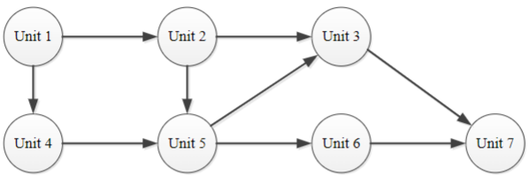
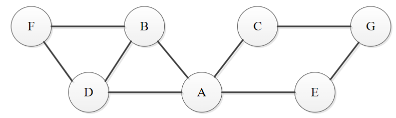
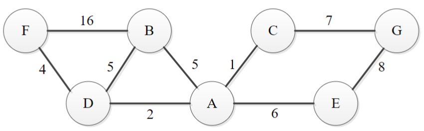
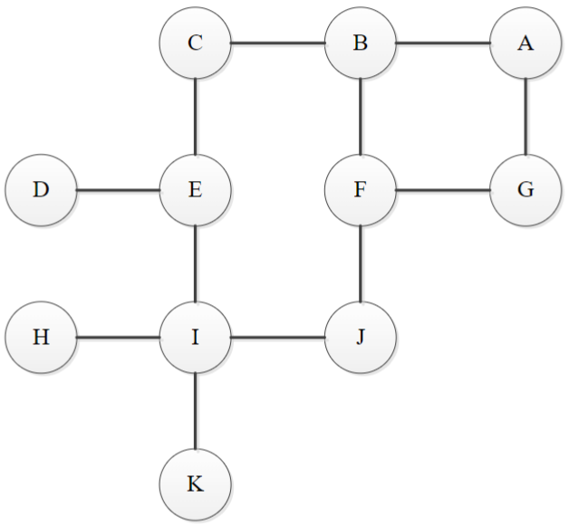
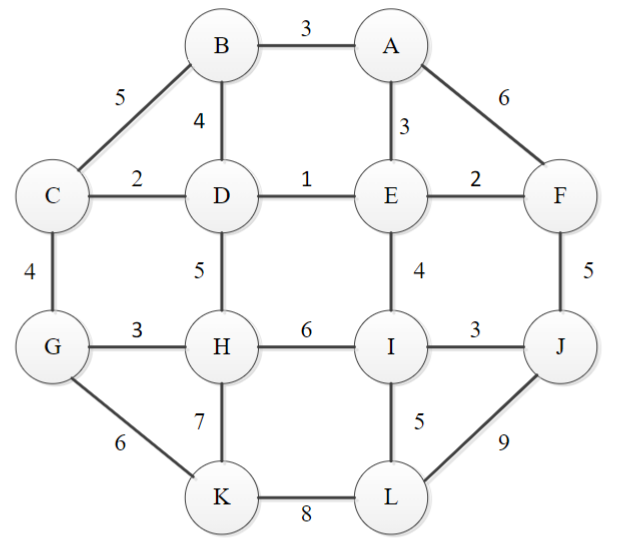

# Workshop 8: Graph Algorithms – I

# Questions

## Question 1. Topological Sort

A directed graph is a graph with a direction specified for all its edges. Consider a set
of 7 required units of study (e.g. IFN664) that a student must take in order to
complete a degree. The units may be taken in any order as long as the following
prerequisites are satisfied.

| Unit | Prerequisites |
|------|---------------|
| Unit 1 | None |
| Unit 2 | Unit 1 |
| Unit 3 | Unit 2, Unit 5 |
| Unit 4 | Unit 1 |
| Unit 5 | Unit 2, Unit 4 |
| Unit 6 | Unit 5 |
| Unit 7 | Unit 3, Unit 6 |

Model these unit requirements as a Directed Acyclic Graph (DAG). List the vertices
in an order that for every edge in the graph the vertex where the edge starts is listed
before the vertex where the edge ends. Can you find such an order in this DAG?

{: .note-title }
> **Answer**
>
> To create the graph:
> - Create a vertex for each unit.
> - Each prerequisite unit points to the unit that requires it (e.g., Unit 1 points to Unit 2).
> - The graph is a Directed Acyclic Graph (DAG) because there are no cycles in the graph.
>
> Here is the graph:
>
> 
>
> To perform topological sort:
>
> 1. Find a vertex with no incoming edges (i.e., no prerequisites).
> 2. Add the vertex to the list.
> 3. Remove the vertex and its outgoing edges from the graph.
> 4. Repeat steps 1-3 until all vertices are added to the list.
>
> A topological sort for the given graph is:
>
> Unit 1, Unit 2, Unit 4, Unit 5, Unit 3, Unit 6, Unit 7

## Question 2. Adjacency List & Adjacency Matrix

a. Consider the following unweighted undirected graph.

Write out the adjacency matrix and adjacency list implementations for this
graph. Assume that the matrix rows, columns and vertices in the adjacency
lists follow in the alphabetical order of the vertex labels.

{: .note-title }
> **Answer**
>
> To create an adjacency matrix:
>
> - Create a 2D array (table) with the number of rows and columns equal to the number of vertices.
> - For each edge (u, v), set the value at the intersection of row u and column v to 1.
> - If the graph is undirected, set the value at the intersection of row v and column u to 1 (mirror by the diagonal).
> - If no edge exists between vertices u and v, set the value to 0.
>
> The adjacency matrix for the given graph is:
>
> |   | A | B | C | D | E | F | G |
> |---|---|---|---|---|---|---|---|
> | A | 0 | 1 | 1 | 1 | 1 | 0 | 0 |
> | B | 1 | 0 | 0 | 1 | 0 | 1 | 0 |
> | C | 1 | 0 | 0 | 0 | 0 | 0 | 1 |
> | D | 1 | 1 | 0 | 0 | 0 | 1 | 0 |
> | E | 1 | 0 | 0 | 0 | 0 | 0 | 1 |
> | F | 0 | 1 | 0 | 1 | 0 | 0 | 0 |
> | G | 0 | 0 | 1 | 0 | 1 | 0 | 0 |
>
> To create an adjacency list, begin by creating a dictionary where the keys are the vertices, and the values are linked lists of adjacent vertices.
>
> - For each edge (u, v), add v to the linked list of u and u to the linked list of v.
>
> The adjacency list for the given graph is:
>
> | Vertex | Adjacent Vertices |
> |--------|-------------------|
> | A      | B → C → D → E     |
> | B      | A → D → F         |
> | C      | A → G             |
> | D      | A → B → F         |
> | E      | A → G             |
> | F      | B → D             |
> | G      | C → E             |

b. Consider the following weighted undirected graph, write out the adjacency
matrix and adjacency list implementations of the graph.

{: .note-title }
> **Answer**
>
> Create an adjacency matrix in a similar way to the unweighted graph, but instead of 1s and 0s, use the weights of the edges, and ∞ for non-existent edges. Diagonal elements are set to 0.
>
> The adjacency matrix for the given weighted graph is:
>
> |   | A | B | C | D | E | F | G |
> |---|---|---|---|---|---|---|---|
> | A | 0 | 5 | 1 | 2 | 6 | ∞ | ∞ |
> | B | 5 | 0 | ∞ | 5 | ∞ | 16 | ∞ |
> | C | 1 | ∞ | 0 | ∞ | ∞ | ∞ | 7 |
> | D | 2 | 5 | ∞ | 0 | ∞ | 4 | ∞ |
> | E | 6 | ∞ | ∞ | ∞ | 0 | ∞ | 8 |
> | F | ∞ | 16 | ∞ | 4 | ∞ | 0 | ∞ |
> | G | ∞ | ∞ | 7 | ∞ | 8 | ∞ | 0 |
>
> An adjacency list is created in the same way as the unweighted graph, but the linked lists contain the weights of the edges.
>
> The adjacency list for the given weighted graph is:
>
> | Vertex | Adjacent Vertices (Weight) |
> |--------|----------------------------|
> | A      | B(5) → C(1) → D(2) → E(6) |
> | B      | A(5) → D(5) → F(16)       |
> | C      | A(1) → G(7)               |
> | D      | A(2) → B(5) → F(4)        |
> | E      | A(6) → G(8)               |
> | F      | B(16) → D(4)              |
> | G      | C(7) → E(8)               |

## Question 3. Depth First Search & Breadth First Search

Consider the following graph where nodes are labelled alphabetically. Assume an
adjacency list is used to store the graph and the nodes in the linked list are in
alphabetical order.

a. List the labels in the order they would be visited when performing a **depth first
search** starting from A.

{: .note-title }
> **Answer**
>
> To perform a depth-first search (DFS), start at the initial vertex (A) and explore as far as possible along each branch before backtracking.
>
> The order in which the labels would be visited when performing a depth-first search starting from A is:
>
> A → B → C → E → D → I → H → J → F → G → K

b. Provide the order in which the labels would be visited when a **breadth first
search** is performed.

{: .note-title }
> **Answer**
>
> To perform a breadth-first search (BFS), start at the initial vertex (A) and explore all of the neighbour vertices at the present depth before moving on to the vertices at the next depth level.
>
> The order in which the labels would be visited when performing a breadth-first search starting from A is:
>
> A → B → G → C → F → E → J → D - I → H → K

## Question 4. Minimum Spanning Tree – Prim’s Algorithm

Apply Prim’s algorithm to the following graph starting at node A. Include in a list
only those vertices not in the current tree which are adjacent to at least one tree
vertex.

{: .note-title }
> **Answer**
>
> In Prim's algorithm starting from node A, we begin with the initial tree containing only the starting vertex A. We then iteratively add the vertex with the minimum edge weight connecting it to the current tree.
>
> The table below shows the vertices and edges added at each step of the algorithm:
>
> 1. Add A to the first column of the table.
> 2. List all edges connecting vertices in the first column to vertices not in the first column. Put these edges in the third column.
> 3. Choose the edge with the minimum weight from the third column, let's say (A, B, 3).
> 4. Create a new row in the table, add B to the first column, and (A, B, 3) to the second column.
> 5. Repeat steps 2-4 until all vertices are added to the table. The second column contains the edges of the minimum spanning tree.
> 
> | $V_T$ | $E_T$ | All the edges such that $v$ is in $V_T$ and $u$ is in $V-V_T$ |
> |---|---|---|
> | {**A**} | {} | (A,B,3), (A,E,3), (A,F,6) |
> | {A,**B**} | {**(A,B,3)**} | (B,C,5), (B,D,4), (A,E,3), (A,F,6) |
> | {A,B,**E**} | {(A,B,3), **(A,E,3)**} | (B,C,5), (B,D,4), (E,D,1), (E,F,2), (A,F,6) |
> | {A,B,**D**,E} | {(A,B,3), (A,E,3), **(E,D,1)**} | (B,C,5), (C,D,2), (D,H,5), (E,I,4), (A,F,6), (E,F,2) |
> | {A,B,**C**,D,E} | {(A,B,3), (A,E,3), (E,D,1), **(C,D,2)**} | (C,G,4), (D,H,5), (E,I,4), (A,F,6), (E,F,2) |
> | {A,B,C,D,E,**F**} | {(A,B,3), (A,E,3), (E,D,1), (C,D,2), **(E,F,2)**} | (C,G,4), (D,H,5), (E,I,4), (F,J,5) |
> | {A,B,C,D,E,F,**G**} | {(A,B,3), (A,E,3), (E,D,1), (C,D,2), (E,F,2), **(C,G,4)**} | (G,H,3), (G,K,6), (D,H,5), (E,I,4), (F,J,5) |
> | {A,B,C,D,E,F,G,**H**} | {(A,B,3), (A,E,3), (E,D,1), (C,D,2), (E,F,2), (C,G,4), **(G,H,3)**} | (G,K,6), (H,K,7), (H,I,6), (E,I,4), (F,J,5) |
> | {A,B,C,D,E,F,G,H,**I**} | {(A,B,3), (A,E,3), (E,D,1), (C,D,2), (E,F,2), (C,G,4), (G,H,3), **(E,I,4)**} | (G,K,6), (H,K,7), (I,L,5), (I,J,3), (F,J,5) |
> | {A,B,C,D,E,F,G,H,I,**J**} | {(A,B,3), (A,E,3), (E,D,1), (C,D,2), (E,F,2), (C,G,4), (G,H,3), (E,I,4), (I,J,3)} | (G,K,6), (H,K,7), (I,L,5), (J,L,9) |
> | {A,B,C,D,E,F,G,H,I,J,**L**} | {(A,B,3), (A,E,3), (E,D,1), (C,D,2), (E,F,2), (C,G,4), (G,H,3), (E,I,4), (I,J,3), **(I,L,5)**} | (G,K,6), (H,K,7), (K,L,8) |
> | {A,B,C,D,E,F,G,H,I,J,**K**,L} | {(A,B,3), (A,E,3), (E,D,1), (C,D,2), (E,F,2), (C,G,4), (G,H,3), (E,I,4), (I,J,3), (I,L,5), **(G,K,6)**} | |
>
> Total weight of the minimum spanning tree (sum of the weights of the edges):
> 
> 3 + 3 + 1 + 2 + 2 + 4 + 3 + 4 + 3 + 5 + 6 = 36

## Question 5. Minimum Spanning Tree – Kruskal’s Algorithm

Apply Kruskal’s algorithm to find the minimum spanning tree of the same graph from
Exercise 4. Show how Kruskal’s algorithm finds an MST of the graph and calculate
the weight of the MST.

{: .note-title }
> **Answer**
>
> In Kruskal's algorithm, we start with an empty tree and iteratively add the edge with the smallest weight that does not create a cycle in the tree.
>
> The edges, sorted by weight in ascending order, are:
>
> | Edge   | Weight |
> |--------|--------|
> | (D,E)  | 1      |
> | (C,D)  | 2      |
> | (E,F)  | 2      |
> | (A,B)  | 3      |
> | (G,H)  | 3      |
> | (I,J)  | 3      |
> | (A,E)  | 3      |
> | (C,G)  | 4      |
> | (E,I)  | 4      |
> | (B,D)  | 4      |
> | (I,L)  | 5      |
> | (F,J)  | 5      |
> | (D,H)  | 5      |
> | (B,C)  | 5      |
> | (G,K)  | 6      |
> | (H,I)  | 6      |
> | (F,A)  | 6      |
> | (H,K)  | 7      |
> | (K,L)  | 8      |
> | (J,L)  | 9      |
>
> In each step, we add the edge with the smallest weight that does not create a cycle. The table below shows the edges added at each step:
>
> | Edge   | Weight | Added |
> |--------|--------| ----- |
> | (D,E)  | 1      | Yes   |
> | (C,D)  | 2      | Yes   |
> | (E,F)  | 2      | Yes   |
> | (A,B)  | 3      | Yes   |
> | (G,H)  | 3      | Yes   |
> | (I,J)  | 3      | Yes   |
> | (A,E)  | 3      | Yes    |
> | (C,G)  | 4      | Yes   |
> | (E,I)  | 4      | Yes   |
> | (B,D)  | 4      | No    |
> | (I,L)  | 5      | Yes   |
> | (F,J)  | 5      | No   |
> | (D,H)  | 5      | No    |
> | (B,C)  | 5      | No    |
> | (G,K)  | 6      | Yes   |
> | (H,I)  | 6      | No    |
> | (F,A)  | 6      | No    |
> | (H,K)  | 7      | No   |
> | (K,L)  | 8      | No   |
> | (J,L)  | 9      | No   |
>
> Total weight of the minimum spanning tree (sum of the weights of the added edges):
>
> 1 + 2 + 2 + 3 + 3 + 3 + 3 + 4 + 4 + 5 + 6 = 36