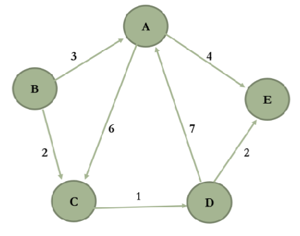
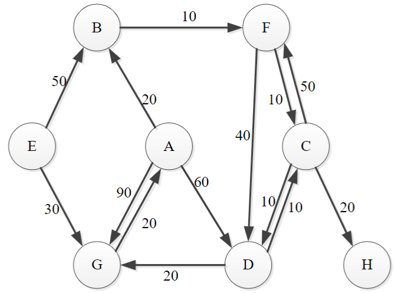
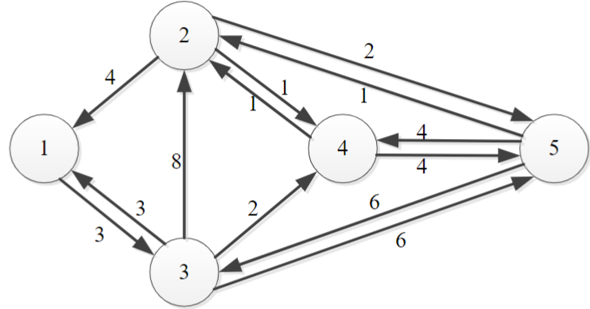
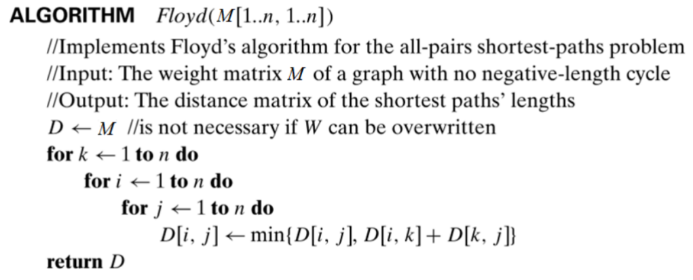

# Workshop 9: Graph Algorithms – II

# Questions

## Question 1: Adjacency Matrix Revision

To aid in the implementation of Questions 2 & 3 (Dijkstra’s algorithm and
Floyd’s algorithm) create an adjacency matrix for the following weighted directed
graph.



As a revision from previous workshop for the interested students also construct an
Adjacency List for the graph.

{: .note-title }
> **Answer**
>
> The adjacency matrix for the graph is as follows:
>
> | | A | B | C | D | E |
> |---|---|---|---|---|---|
> | A | ∞ | ∞ | 6 | ∞ | 4 |
> | B | 3 | ∞ | 2 | ∞ | ∞ |
> | C | ∞ | ∞ | ∞ | 1 | ∞ |
> | D | 7 | ∞ | ∞ | ∞ | 2 |
> | E | ∞ | ∞ | ∞ | ∞ | ∞ |
>
> And the adjacency list for the graph is as follows:
>
>
> | Vertex | Adjacent Vertices (Weight) |
> |--------|----------------------------|
> | A      | C(6), E(4)                 |
> | B      | A(3), C(2)                 |
> | C      | D(1)                      |
> | D      | A(7), E(2)                 |
> | E      |                            |

## Question 2: Dijkstra’s Algorithm

Use Dijkstra's algorithm to find the shortest paths and distances to all vertices,
with A as the source using the following graph. Show full details of your working
to illustrate your understanding of the algorithm.



{: .note-title }
> **Answer**
>
> The adjacency matrix for the graph is as follows:
>
> | | A | B | C | D | E | F | G | H |
> |---|---|---|---|---|---|---|---|---|
> | A | ∞ | 20 | ∞ | 60 | ∞ | ∞ | 90 | ∞ |
> | B | ∞ | ∞ | ∞ | ∞ | ∞ | 10 | ∞ | ∞ |
> | C | ∞ | ∞ | ∞ | 10 | ∞ | 50 | ∞ | 20 |
> | D | ∞ | ∞ | 10 | ∞ | ∞ | ∞ | 20 | ∞ |
> | E | ∞ | 50 | ∞ | ∞ | ∞ | ∞ | 30 | ∞ |
> | F | ∞ | ∞ | 10 | 40 | ∞ | ∞ | ∞ | ∞ |
> | G | 20 | ∞ | ∞ | ∞ | ∞ | ∞ | ∞ | ∞ |
> | H | ∞ | ∞ | ∞ | ∞ | ∞ | ∞ | ∞ | ∞ |
>
> The table below shows the list of vertices visited in each iteration of the Dijkstra's algorithm. In each iteration:
>
> - Via the most recently visited vertex, calculate the distance to each unvisited vertex, and update if new distance is shorter.
> - Find the closest unvisited vertex and mark it as visited.
>
> | Iteration | Visited Vertices | A | B | C | D | E | F | G | H | Closest Unvisited Node | Notes |
> |-----------|------------------|---|---|---|---|---|---|---|---| ----- | ----- |
> | 0         | [A]                | ∞ | 20 | ∞ | 60 | ∞ | ∞ | 90 | ∞ | B (20) | Initial state (same as source row) |
> | 1         | [A, B]             | ∞ | 20 | ∞ | 60 | ∞ | **30** | 90 | ∞ | F (30) | B goes to F |
> | 2         | [A, B, F]          | ∞ | 20 | **40** | 60 | ∞ | 30 | 90 | ∞ | C (40) | F goes to C (30 + 10 = 40 < ∞), D (30 + 40 = 70 > 60) |
> | 3         | [A, B, F, C]       | ∞ | 20 | 40 | **50** | ∞ | 30 | 90 | **60** | D (50) | C goes to D (40 + 10 = 50 < 60), H (40 + 20 = 60); F has already been visited |
> | 4         | [A, B, F, C, D]    | ∞ | 20 | 40 | 50 | ∞ | 30 | **70** | 60 | G (70) | D goes to G (50 + 20 = 70 < ∞); C has already been visited |
> | 5         | [A, B, F, C, D, G] | ∞ | 20 | 40 | 50 | ∞ | 30 | 70 | 60 | H (70) | G does not go to any unvisited nodes |
> | 6         | [A, B, F, C, D, G, H] | ∞ | 20 | 40 | 50 | ∞ | 30 | 70 | 60 | E (∞) | H does not go to any unvisited nodes |
>
> To find the shortest path, find the iteration where the distance to the destination node is **last updated from ∞**.
>
> - B was last updated in iteration 0, so the shortest path from A to B is A → B.
> - C was last updated in iteration 2, so the shortest path from A to C is A → B → F → C.
> - D was last updated in iteration 3, so the shortest path from A to D is A → B → F → C → D.
> - E was never updated from ∞, so there is no path from A to E.
> - F was last updated in iteration 1, so the shortest path from A to F is A → B → F.
> - G was last updated in iteration 4, so the shortest path from A to G is A → B → F → C → D → G.
> - H was last updated in iteration 3, so the shortest path from A to H is A → B → F → C → H.

## Question 3: Floyd’s Algorithm

Use Floyd's algorithm to find the shortest distance between every pair of vertices
in the graph below. Show full details of your working to illustrate your
understanding of the algorithm showing how the distance matrix updates as you
work through each node. In your working show which matrix elements have been
updated from the previous step.



As there are 5 nodes in the graph how many passes over the algorithm will be
required?

Edges:

{: .note-title }
> **Answer**
>
> The adjacency matrix for the graph is as follows:
>
> | | 1 | 2 | 3 | 4 | 5 |
> |---|---|---|---|---|---|
> | 1 | ∞ | ∞ | 3 | ∞ | ∞ |
> | 2 | 4 | ∞ | ∞ | 1 | 2 |
> | 3 | 3 | 8 | ∞ | 2 | 6 |
> | 4 | ∞ | 1 | ∞ | ∞ | 4 |
> | 5 | ∞ | 1 | 6 | 4 | ∞ |
>
> **Step 1**: Pass through node 1
>
> | | 1 | 2 | 3 | 4 | 5 |
> |---|---|---|---|---|---|
> | 1 | `∞` | `∞` | `3` | `∞` | `∞` |
> | 2 | `4` | ∞ | ***7*** | 1 | 2 |
> | 3 | `3` | 8 | ***6*** | 2 | 6 |
> | 4 | `∞` | 1 | ∞ | ∞ | 4 |
> | 5 | `∞` | 1 | 6 | 4 | ∞ |
>
> **Tip**: Look for rows and columns that are *not infinity*, and update the intersection of the row and column with the sum of the two values (**if it is less than the current value**).
>
> Updated values are shown in ***bold***.
>
> **Step 2**: Pass through node 2
>
> | | 1 | 2 | 3 | 4 | 5 |
> |---|---|---|---|---|---|
> | 1 | ∞ | `∞` | 3 | ∞ | ∞ |
> | 2 | `4` | `∞` | `7` | `1` | `2` |
> | 3 | *3* | `8` | *6* | *2* | *6* |
> | 4 | ***5*** | `1` | ***8*** | ***2*** | ***3*** |
> | 5 | ***5*** | `1` | *6* | ***2*** | ***3*** |
>
> **Step 3**: Pass through node 3
>
> | | 1 | 2 | 3 | 4 | 5 |
> |---|---|---|---|---|---|
> | 1 | ***6*** | ***11*** | `3` | ***5*** | ***9*** |
> | 2 | *4* | ***15*** | `7` | *1* | *2* |
> | 3 | `3` | `8` | `6` | `2` | `6` |
> | 4 | *5* | *1* | `8` | *2* | *3* |
> | 5 | *5* | *1* | `6` | *2* | *3* |
>
> **Step 4**: Pass through node 4
>
> | | 1 | 2 | 3 | 4 | 5 |
> |---|---|---|---|---|---|
> | 1 | *6* | ***6*** | *3* | `5` | ***8*** |
> | 2 | *4* | ***2*** | *7* | `1` | *2* |
> | 3 | *3* | ***3*** | *6* | `2` | ***5*** |
> | 4 | `5` | `1` | `8` | `2` | `3` |
> | 5 | *5* | *1* | *6* | `2` | *3* |
>
> **Step 5**: Pass through node 5
>
> | | 1 | 2 | 3 | 4 | 5 |
> |---|---|---|---|---|---|
> | 1 | *6* | *6* | *3* | *5* | `8` |
> | 2 | *4* | *2* | *7* | *1* | `2` |
> | 3 | *3* | *3* | *6* | *2* | `5` |
> | 4 | *5* | *1* | *8* | *2* | `3` |
> | 5 | `5` | `1` | `6` | `2` | `3` |
>
> Number of passes equals the number of nodes in the graph, which is 5, however, the number of comparisons is equal to the number of nodes cubed, which is 125.

## Question 4: Implementation of Floyd’s Algorithm

A driver program (`Program.cs`) has been provided for testing Floyd’s algorithm.
A simple graph has been provided as an input into the algorithm which is
initialized in `Main()`. Implement Floyd’s algorithm using the pseudo-code
provided below.



If the implementation is correct, the following matrix with the shortest distances
between each pair of vertices should be shown as below. (INF means there is no
path between the vertices)

{: .note-title }
> **Answer**
>
> ```csharp
> using System;
> using System.Collections.Generic;
> using System.Linq;
> using System.Text;
> using System.Threading.Tasks;
> 
> namespace FloydsAlgorithm
> {
>     class Program
>     {
> 
>         // Number of vertices in the graph
>         static int V = 5;
> 
>         /* Define Infinite as a large enough value. This value will be used
>           for vertices not connected to each other */
>         static int INF = 99999;
> 
> 
>         static void Main(string[] args)
>         {
>             /* Let us create the following weighted graph
>                    10
>               (0)------->(3)
>                |         /|\
>              5 |          |
>                |          | 1
>               \|/         |
>               (1)------->(2)
>                    3           */
>             int[,] graph = { {INF,   8,  INF, 9, 4},
>                         {INF, INF,   1, INF, INF},
>                         {INF, 2, INF,   3, INF},
>                         {INF, INF, 2, INF, 7},
>                         {INF, INF, 1, INF, INF}
>                       };
> 
>             // Print the solution
>             FloydsAlgorithm(graph);
>             Console.ReadKey();
>         }
> 
>         // A function to print the solution matrix
>         //  void printSolution(int dist[][V]);
> 
>         // Solves the all-pairs shortest path problem using Floyd Warshall algorithm
>        static void FloydsAlgorithm(int[,] graph)
>         {
>             /* dist[][] will be the output matrix that will finally have the shortest
>               distances between every pair of vertices */
>             int[,] dist = new int[V, V];
>             int i, j, k;
> 
>             /* Initialize the solution matrix same as input graph matrix. Or
>                we can say the initial values of shortest distances are based
>                on shortest paths considering no intermediate vertex. */
>             for (i = 0; i < V; i++)
>                 for (j = 0; j < V; j++)
>                     dist[i, j] = graph[i, j];
> 
>             /* Add all vertices one by one to the set of intermediate vertices.
>               ---> Before start of a iteration, we have shortest distances between all
>               pairs of vertices such that the shortest distances consider only the
>               vertices in set {0, 1, 2, .. k-1} as intermediate vertices.
>               ----> After the end of a iteration, vertex no. k is added to the set of
>               intermediate vertices and the set becomes {0, 1, 2, .. k} */
>             for (k = 0; k < V; k++)
>             {
>                 // Pick all vertices as source one by one
>                 for (i = 0; i < V; i++)
>                 {
>                     // Pick all vertices as destination for the
>                     // above picked source
>                     for (j = 0; j < V; j++)
>                     {
>                         // If vertex k is on the shortest path from
>                         // i to j, then update the value of dist[i][j]
>                         if (dist[i, k] + dist[k, j] < dist[i, j])
>                             dist[i, j] = dist[i, k] + dist[k, j];
>                     }
>                 }
>             }
> 
>             // Print the shortest distance matrix
>             printSolution(dist);
>         }
>         /* A utility function to print solution */
>       static  void printSolution(int[,] dist)
>         {
>             Console.Write("Following matrix shows the shortest distances\n" +
>                     " between every pair of vertices \n");
>             Console.Write("     ");
>             for (int m = 0; m < V; m++)
>             {
>                 Console.Write("        " + m);
>             }
>             Console.Write("\r\n");
>             Console.WriteLine("=======================================================");
>             for (int i = 0; i < V; i++)
>             {
>                 Console.Write("    " + i);
>                 for (int j = 0; j < V; j++)
>                 {
> 
>                     if (dist[i, j] == INF)
>                     {
>                         Console.Write("        " + "INF");
>                     }
>                     else
>                     {
>                         Console.Write("        " + dist[i, j]);
>                     }
>                 }
>                 Console.Write("\r\n");
>             }
>         }
>     }
> }
> ```