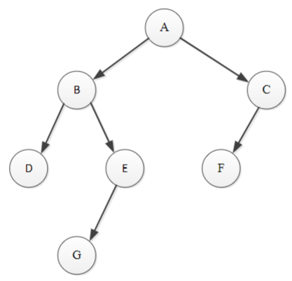
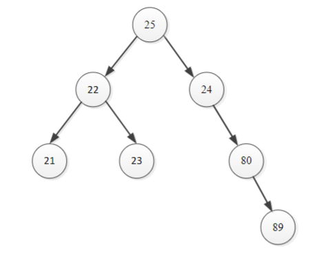
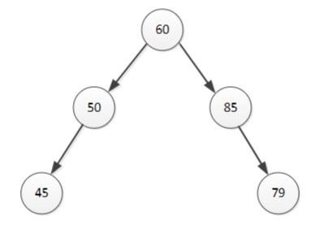
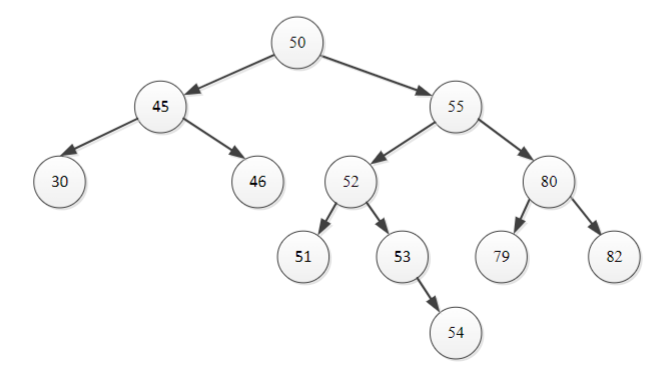
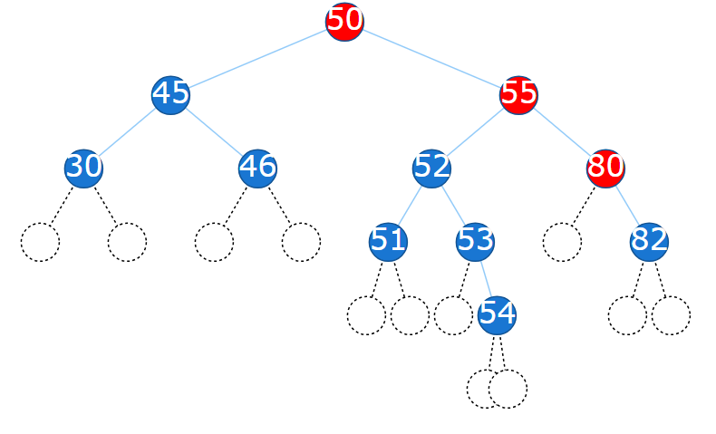
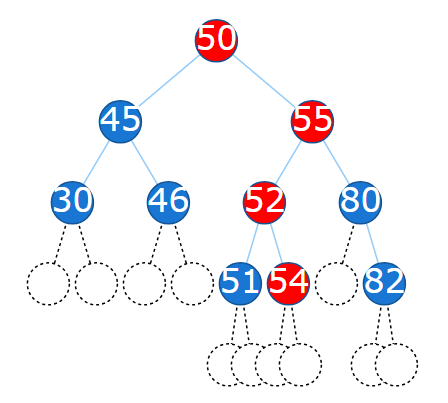
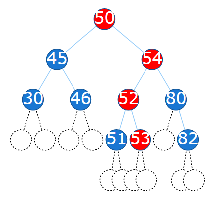
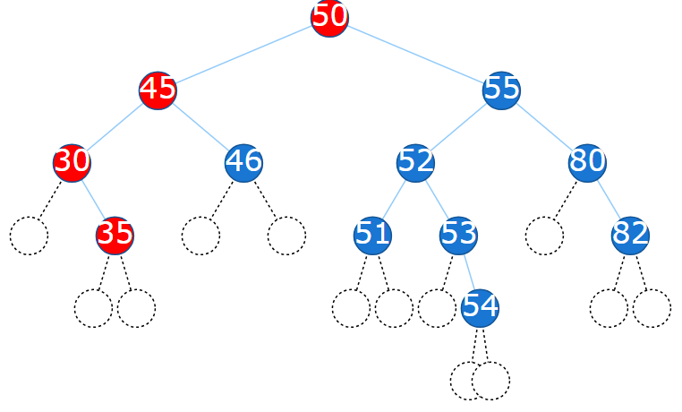
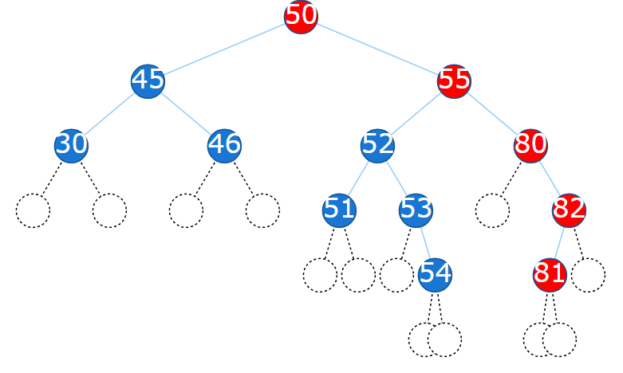

# Workshop 5: Binary Tree, Binary Search Tree and Algorithms

{: .no_toc }

<details open markdown="block">
  <summary>
    Table of contents
  </summary>
  {: .text-delta }
- TOC
{:toc}
</details>

# Part A: Binary Tree Algorithms

## Question 1: Binary Tree Traversal

There are three common orders in which the nodes in a binary tree can be traversed.
For each of the following binary trees, show the resulting order in which the nodes in
the binary tree are visited using:



a. Pre-order traversal

> **Answer**: A, B, D, E, G, C, F
>
> In pre-order traversal, the nodes are visited in the following order:
>
> 1. Visit the root
> 2. Traverse the left subtree
> 3. Traverse the right subtree
>
> This is useful for creating a copy of the tree.

b. Post-order traversal

> **Answer**: D, G, E, B, F, C, A
>
> In post-order traversal, the nodes are visited in the following order:
>
> 1. Traverse the left subtree
> 2. Traverse the right subtree
> 3. Visit the root
>
> This is useful for deleting the tree, as the leaves are deleted first.

c. In-order traversal

> **Answer**: D, B, G, E, A, F, C
>
> In in-order traversal, the nodes are visited in the following order:
>
> 1. Traverse the left subtree
> 2. Visit the root
> 3. Traverse the right subtree
>
> This is useful for printing the nodes in a sorted order (in a binary search tree).

## Question 2: Binary Search Tree

Which of the following are binary search trees?

a.



> **Answer**: Not a Binary Search Tree
>
> This is because the right child (24) of the root node (25) is less than the root node.

b.



> **Answer**: Not a Binary Search Tree
>
> Looking at the right sub tree, the node (85) has a right child (79) less than itself, which is a same issue as the previous example.

c.



> **Answer**: Binary Search Tree
>
> All left children are less than the parent node, and all right children are greater than the parent node.

## Question 3: Search/Deleting/Adding Nodes to a Binary Search Tree

> You can try out these using the BST visualisation in this week's [tutorial slides](https://cab301.github.io/slides/Tutorial_5).

For the valid binary search tree from **Question 2:**

a) Show the nodes which are visited when searching for:

```
i. 52
ii. 46
iii. 75
```

> **Answer**:
> i. 50, 55, 52
> ii. 50, 45, 46
> iii. 50, 55, 80, 79
>
> When searching, the algorithm compares the value to the current node.
>
> - If the value is less than the current node, it moves to the left child.
> - If the value is greater than the current node, it moves to the right child.

b) Delete the following nodes and show the new binary search tree:

```
i. 79
ii. 53
iii. 55
```

> **Answer**
>
> i. 79. Not exist, so no change. Red nodes are the nodes visited.
> 
>
> ii. 53. Has a single child, so it is replaced by its child.
> 
>
> iii. 55. Has two children, so it is replaced by the largest node in its left subtree (54).
> 

c) Add the following nodes and show the new binary search tree:

```
i. 35
ii. 81
```

> **Answer**
>
> i. 35. Searching for 35 ends at 30, so 35 is added as the right child of 30.
> 
>
> ii. 81. Searching for 81 ends at 82, so 81 is added as the left child of 82.
> 

## Part B: Programming Tasks

4. You are provided a C# implementation of Binary Search Tree where each node
   represents a char. Reuse the code to create a Binary Search Tree of _Customer_
   objects and test the methods in the Binary Search Tree, including _Insert_ , _Delete,_
   _Search_ , _PreOrderTravrse_ , _InOrderTraverse and PostOrderTraverse._

> **Answer**: You may copy the following code into your program.

`BSTree.cs` has the code for the Binary Search Tree implementation (including a `BTreeNode` class and a `BSTree` class).

```csharp
using System;
namespace BinarySearchTree;

public class BTreeNode
{
    public IComparable Data { get; set; }
    public BTreeNode Left { get; set; }
    public BTreeNode Right { get; set; }

    public BTreeNode(IComparable item)
    {
        Data = item;
        Left = null;
        Right = null;
    }
}

public class BSTree
{
    private BTreeNode root;

    public BSTree()
    {
        root = null;
    }

    public bool IsEmpty()
    {
        return root == null;
    }

    public bool Search(IComparable item)
    {
        return Search(item, root);
    }

    private bool Search(IComparable item, BTreeNode r)
    {
        if(r != null)
        {
            if(item.CompareTo(r.Item) == 0)
                return true;
            else
                if(item.CompareTo(r.Item) < 0 )
                return Search(item, r.LChild);
            else
                return Search(item, r.RChild);
        }
        else
            return false;
    }

    public void Insert(IComparable item)
    {
        if(root == null)
            root = new BTreeNode(item);
        else
            Insert(item, root);
    }

    // pre: ptr != null
    // post: item is inserted to the binary search tree rooted at ptr
    private void Insert (IComparable item, BTreeNode ptr)
    {
        if (item.CompareTo(ptr.Item) < 0)
        {
            if (ptr.LChild == null)
                ptr.LChild = new BTreeNode(item);
            else
                Insert(item, ptr.LChild);
        }
        else
        {
            if (ptr.RChild == null)
                ptr.RChild = new BTreeNode(item);
            else
                Insert(item, ptr.RChild);
        }
    }

    // there are three cases to consider:
    // 1. the node to be deleted is a leaf
    // 2. the node to be deleted has only one child
    // 3. the node to be deleted has both left and right children
    public void Delete(IComparable item)
    {
        // search for item and its parent
        BTreeNode ptr = root; // search reference
        BTreeNode parent = null; // parent of ptr
        while((ptr!=null)&&(item.CompareTo(ptr.Item)!=0))
        {
            parent = ptr;
            if(item.CompareTo(ptr.Item) < 0) // move to the left child of ptr
                ptr = ptr.LChild;
            else
                ptr = ptr.RChild;
        }

        if(ptr != null) // if the search was successful
        {
            // case 3: item has two children
            if((ptr.LChild != null)&&(ptr.RChild != null))
            {
                // find the right-most node in left subtree of ptr
                if(ptr.LChild.RChild == null) // a special case: the right subtree of ptr.LChild is empty
                {
                    ptr.Item = ptr.LChild.Item;
                    ptr.LChild = ptr.LChild.LChild;
                }
                else
                {
                    BTreeNode p = ptr.LChild;
                    BTreeNode pp = ptr; // parent of p
                    while(p.RChild != null)
                    {
                        pp = p;
                        p = p.RChild;
                    }
                    // copy the item at p to ptr
                    ptr.Item = p.Item;
                    pp.RChild = p.LChild;
                }
            }
            else // cases 1 & 2: item has no or only one child
            {
                BTreeNode c;
                if(ptr.LChild != null)
                    c = ptr.LChild;
                else
                    c = ptr.RChild;

                // remove node ptr
                if(ptr == root) //need to change root
                    root = c;
                else
                {
                    if(ptr == parent.LChild)
                        parent.LChild = c;
                    else
                        parent.RChild = c;
                }
            }

        }
    }

    public void PreOrderTraverse()
    {
        Console.Write("PreOrder: ");
        PreOrderTraverse(root);
        Console.WriteLine();
    }

    private void PreOrderTraverse(BTreeNode root)
    {
        if(root != null)
        {
            Console.Write(root.Item);
            PreOrderTraverse(root.LChild);
            PreOrderTraverse(root.RChild);
        }
    }

    public void InOrderTraverse()
    {
        Console.Write("InOrder: ");
        InOrderTraverse(root);
        Console.WriteLine();
    }

    private void InOrderTraverse(BTreeNode root)
    {
        if(root != null)
        {
            InOrderTraverse(root.LChild);
            Console.Write(root.Item);
            InOrderTraverse(root.RChild);
        }
    }

    public void PostOrderTraverse()
    {
        Console.Write("PostOrder: ");
        PostOrderTraverse(root);
        Console.WriteLine();
    }

    private void PostOrderTraverse(BTreeNode root)
    {
        if(root != null)
        {
            PostOrderTraverse(root.LChild);
            PostOrderTraverse(root.RChild);
            Console.Write(root.Item);
        }
    }

    public void Clear()
    {
        root = null;
    }
}
```

`Customer.cs` has the code for the `Customer` class.

```csharp
using System;
using System.Collections.Generic;
using System.Text;
namespace BinarySearchTree;

class Customer: IComparable
{
    public string FirstName { get; private set; }
    public string LastName { get; private set; }

    public int Mobile { get; private set; }

    public Customer(string lastName, string firstName, int mobileNumber)
    {
        FirstName = firstName;
        LastName = lastName;
        Mobile = mobileNumber;
    }

    public int CompareTo(Object obj)
    {
        Customer another = (Customer)obj;
        if (LastName.CompareTo(another.LastName) < 0)
            return -1;
        else
                if (LastName.CompareTo(another.LastName) == 0)
                    return FirstName.CompareTo(another.FirstName);
                else
                    return 1;
    }


    public override string ToString()
    {
            return (FirstName + " " + LastName + " " + Mobile.ToString() + "\n");
    }
}
```

`Program.cs` has the code to test the `BSTree` class with `Customer` objects.

```csharp
using System;
using BSTreeInterface;
using BSTreeClass;
namespace BinarySearchTree;

public class Program
{
	static public void Main()
	{
		// build a Binary Search Tree (BST)
        //Initially it is empty
		IBSTree aBSTree = new BSTree();

        // use the Insert method to insert some Customer objects into the BST
        aBSTree.Insert(new Customer("Morris", "Scott", 11111111));
		aBSTree.Insert(new Customer("Turnbull", "Malcolm", 22222222));
		aBSTree.Insert(new Customer("Rudd", "Kevin", 33333333));
		aBSTree.Insert(new Customer("Gillard", "Julia", 44444444));
		aBSTree.Insert(new Customer("Howard", "John", 55555555));
        aBSTree.Insert(new Customer("Bill", "Clinton", 66666666));
        aBSTree.Insert(new Customer("Barack", "Obama", 77777777));


        // pre-order traversal
        aBSTree.PreOrderTraverse();
		// in-order traversal
		aBSTree.InOrderTraverse();
		// post-order traversal
		aBSTree.PostOrderTraverse();

		// delete a leaf node
		aBSTree.Delete(new Customer("Howard", "John", 55555555));

		// pre-order traversal
		aBSTree.PreOrderTraverse();
		// in-order traversal
		aBSTree.InOrderTraverse();
		// post-order traversal
		aBSTree.PostOrderTraverse();

		// insert the deleted node  back to the BST
		aBSTree.Insert(new Customer("Howard", "John", 55555555));
        // delete a node that has only one child
        aBSTree.Delete(new Customer("Turnbull", "Malcolm", 22222222));

        // pre-order traversal
        aBSTree.PreOrderTraverse();
        // in-order traversal
        aBSTree.InOrderTraverse();
        // post-order traversal
        aBSTree.PostOrderTraverse();

        // insert the deleted node back to the BST
        aBSTree.Insert(new Customer("Turnbull", "Malcolm", 22222222));
        // delete a node that has only one child
        aBSTree.Delete(new Customer("Gillard", "Julia", 44444444));

        // pre-order traversal
        aBSTree.PreOrderTraverse();
        // in-order traversal
        aBSTree.InOrderTraverse();
        // post-order traversal
        aBSTree.PostOrderTraverse();

        aBSTree.Insert(new Customer("Gillard", "Julia", 44444444));

        Customer aCustomer = new Customer("Gillard", "Julia", 44444444);
        bool aBool = aBSTree.Search(aCustomer);
        if (aBool)
            Console.WriteLine(aCustomer.ToString() + "is in the BST");
        else
            Console.WriteLine(aCustomer.ToString() + "is not in the BST");

        // clear the binary tree
        aBSTree.Clear();

        // pre-order traversal
        aBSTree.PreOrderTraverse();
        // in-order traversal
        aBSTree.InOrderTraverse();
        // post-order traversal
        aBSTree.PostOrderTraverse();
    }
}
```
